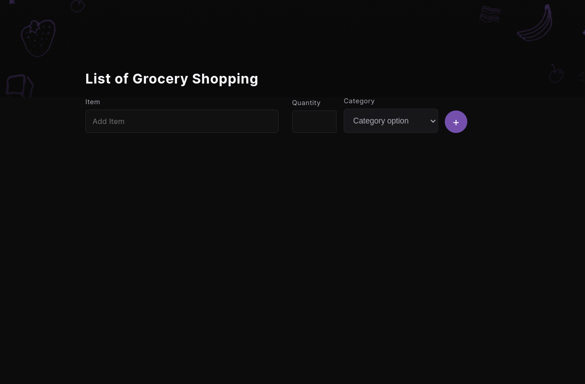
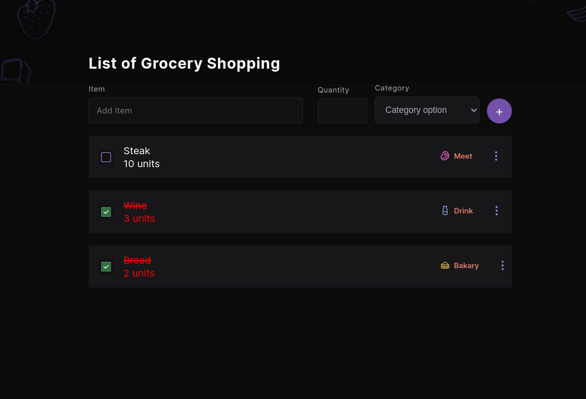

# React List of Grocery Shopping Web3 🧨🎯

## ICP Zero to Dapp Hackathon Powered by Encode 🔋🚀🚧

### Newbie Bounty


🌏🏛 This project was created at the EnCode Club hackathon event that I took part. I created a simple project using ICP technologies to create a web3 on the blockchain. This project is a grocery shopping list. This project was created at the EnCode Club hackathon event which I participated in. I created a simple project using ICP technologies to create a web3 on the blockchain. This project is a shopping list. My first project using blockchain, so I decided to make it simple to learn and now I am confident about increasing my skills in web3 development.

**Technologies Used** 🤖 💻

- NextJS ✅
  
- ICP Blockchain canister ✅
  
- Stitches CSS ✅
  
- Typescript ✅

- React-hook-form ✅

- Zod ✅

    
#### Gettinn Started 🏁

1. **Download the project.** ⚡
  
  ```bash
  git clone git@github.com:igormachado/list-of-grocery-shopping-web-3.git
  ```
  
2. **Install project dependencies, npm** ⚡
  

```bash
cd list-of-grocery-shopping-web-3
npm install        
```

#### Explaining the project List of Grocery Shopping Web3

**pages/index** 🧨

  
  - This page is the main one for the project.
  - With 3 components (Header, Form, ListAllProduct)
    

```js
export default function Home() {
  return (
    <>
      <ListContextProvider>
        <Header />
        <Form />
        <ListAllProduct />
      </ListContextProvider>
    </>
  )
}
```

- ***Component Form***
  
  - src/components/Form.  

```js

//create a schema to every item
// all item is required. Do not create item empty
const schema = z.object({
  item: z.string().min(4, { message: "Required" }),
  quantity: z.string().min(1, { message: "Required" }),
  category: z.string().min(4, { message: "Required" }),
});

  // Create a useForm with 3 functions
  // register this function get inputs from item/quantity/category
  // handleSubmit this function submit form when all register is complety
  // reset this function clean all inputs after submit form.
  // formState show error when try to submit input empty.
  const {
    register,
    handleSubmit,
    reset,
    formState: { errors },
  } = useForm<ListItemProps>({ resolver: zodResolver(schema) });

  const { listItems, setListItems } = useContext(ListContext);


  // this function create item after input.
  const onSubmit: SubmitHandler<ListItemProps> = ({
    item,
    quantity,
    category,
  }: ListItemProps) => {
    setListItems([...listItems, { item, quantity, category }]);
    reset();
  };
```

- ***Component List***
  
  - src/components/List.
  
```js
// This function is a boolean false/true
// if click true else false
 const [active, setActive] = useState(false)

  function handleClickActive() {
    setActive(!active)
  }

  // if active is true input checked change to green
  // else gray.
  <button onClick={handleClickActive}>
    {active ? (
      <Image src={uncheckedImg} alt="unchecked item" />
          ) : (
      <Image src={checkGreenImg} alt="checked item" />
    )}
  </button>
  // if input checked is true the style item changed.
  <div> 
    <span
      style={{
        textDecoration: active ? 'line-through' : '',
        color: active ? 'red' : '',
        }}
      >
      {product.item}
    </span>
    <span style={{ color: active ? 'red' : '' }}>
      {product.quantity}
    </span>
  </div>


  //When select a category the same image is select.
  <p>
    {product.category === 'Fruit' ? (
      <Image src={FruitImg} alt="fruit" />
    ) : product.category === 'Meet' ? (
      <Image src={MeetImg} alt="meet" />
    ) : product.category === 'Drink' ? (
      <Image src={DrinkImg} alt="drink" />
    ) : product.category === 'Bakary' ? (
      <Image src={BakaryImg} alt="bakary" />
    ) : (
      <Image src={VegetableImg} alt="Vegetable" />
    )}
    <span>{product.category}</span>
  </p>
  <Image src={moreVerticalImg} alt="3 point vertical" />


// This function show item when is create.
export default function ListAllProduct() {
  const { listItems } = useContext(ListContext)
  return (
    <>
      {listItems.map((product) => (
        <List
          key={product.item}
          item={product.item}
          category={product.category}
          quantity={
            product.quantity === '1'
              ? product.quantity + ' unit'
              : product.quantity + ' units'
          }
        />
      ))}
    </>
  )
}
```

### Project Images



